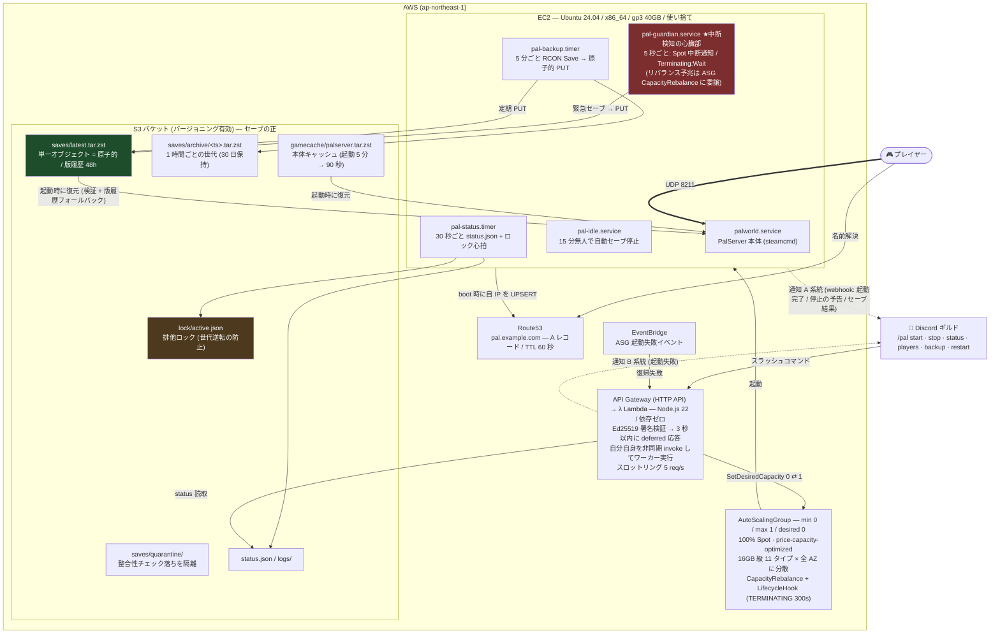

# Palworld スポットサーバー管理システム 設計書

## Context

友人内でパルワールド専用サーバーを運用したいが、常時起動の EC2 は高い（16GB 級オンデマンドで月 $180 前後）。
遊ぶ時だけ Discord から起動・停止し、スポットインスタンスで 7〜8 割引で走らせたい。

ただしスポットには「2 分前通知で強制回収される」という制約がある。パルワールドのセーブは
サーバープロセスがメモリ上に持っており、落ち方が悪いと**数十分〜数時間分のワールド進行が消える**。
このシステムの設計上の中核はコスト削減そのものではなく、**「いつ落とされても直前の状態が S3 に残っている」ことを保証する仕組み**にある。

到達点:

- Discord の `/pal start` `/pal stop` で起動・停止できる
- スポット中断されてもセーブが失われず、自動的に別インスタンスで復帰する
- 15 分無人で自動停止し、消し忘れによる課金が発生しない
- `terraform apply` 一発で全部立ち上がる

---

## 基本理念: シンプルで低コストであること

すべての設計判断はこの理念に照らして行う。具体的には次の 3 つのルールに落とす。

1. **待機コストゼロ** — 遊んでいない間に課金される常駐要素を持たない。
   停止中のコストは「データの置き場代」(S3 + Route53 で月 $1 未満) だけに限る
2. **部品は最少** — プラットフォームの標準機能で済むことを自前実装しない。
   新しい AWS リソースや常駐プロセスを足すときは、それが無いと何が壊れるかを言えること
3. **複雑さの予算は「セーブを失わない」にだけ使う** — 本システムで唯一、
   複雑になってよいのはセーブ保全 (多層防御・排他制御) の部分。
   それ以外の機能は多少不便でも単純な形を選ぶ

機能追加の判断基準: 「それはセーブを守るか？ 守らないなら、月額と部品数を増やさずに済むか？」

---

## 全体アーキテクチャ



（`quarantine` へは整合性チェックに落ちたアーカイブのみが退避される。層 4 参照）

EC2 は完全に使い捨て。状態はすべて S3 にあり、インスタンスは「S3 から復元して走らせるだけの器」。

---

## 中核設計: セーブを失わないための多層防御

これが本システムで最も重要な部分。単一の仕組みには頼らず 5 層で守る。

### 層 1: 定期バックアップ（5 分ごと）

`pal-backup.timer` が RCON `Save` を送ってフラッシュさせた後、`Pal/Saved/SaveGames` を
**まずローカルにスナップショットコピーし、コピー側を** tar+zstd で固めて
**単一オブジェクトとして** `saves/latest.tar.zst` に PUT する。

- 単一 PUT なので**原子的**。アップロード中に電源が落ちても S3 上の既存オブジェクトは壊れない
  （`aws s3 sync` によるファイル単位同期だと、途中で切られた場合に中途半端な状態が残るため採用しない）
- **スナップショットコピーを挟む理由**: Palworld は自前のオートセーブも走らせるため、
  ライブディレクトリを直接 tar すると書き込みと重なって「半分新しく半分古い」アーカイブができうる。
  先にローカルコピー（数百 MB で 1〜2 秒）してから固めることで一貫した断面を取る
- バケットはバージョニング有効。同じキーに上書きしても過去世代は自動的に残る
- 最悪ケースでもロストは 5 分以内

**バージョン履歴の保持期間は 48 時間**（+ 直近 10 世代は無条件保持）。
5 分間隔の上書きを 30 日分残すと非現行バージョンだけで 160GB 級 (月 $4 前後) に膨らむため、
「壊れたセーブで上書きされた事故からのロールバック」に必要な 48 時間に絞る。
30 日スパンの世代管理は、バックアップスクリプトが 1 時間ごとに `saves/archive/<ts>.tar.zst` へ
コピーする世代アーカイブが担う。

### 層 2: 終了の兆候の検知

`pal-guardian.service` が「終了させられそうだ」という兆候を 2 系統で見張り、
掴んだ瞬間に緊急停止シーケンスへ入る。フラグファイルで多重起動を防ぐ。

用語は次のように使い分ける。「回収」を単独では使わない（どちらの意味にも読めるため）。
ただし**この区別はログとドキュメントのためのもので、通知には出さない**
（利用者がとる行動は同じなので分けても判断の助けにならない。通知設計の節を参照）。

- **スポット中断** … 2 分後に強制終了するという AWS の確定通知。締切がある
- **スポット回収の予兆** … 中断の危険が高まったという AWS の予報（リバランス推奨）。締切はない

予報は外れること（結局中断されないこと）もあるが、`capacity_rebalance = true` にしているため
**当たり外れを待たず、予兆を受けた時点で必ず引っ越す**。外れた場合の損失は「余分に 1 回
引っ越した」だけで、当たった場合は 2 分の締切に追われずに済む。損失と利得が非対称なので、
常に動く側へ倒している。

| | 系統 1: スポット中断 | 系統 2: ASG の終了指示 |
| --- | --- | --- |
| 何が起きている | AWS がハードウェアを取り上げる（確定） | 台数調整（`/pal stop`・回収の予兆による置換）による終了 |
| どこで分かる | IMDSv2 `/latest/meta-data/spot/instance-action` | `describe-auto-scaling-instances` が `Terminating:Wait` |
| 猶予 | **約 2 分** | **300 秒**（ライフサイクルフックの設定値） |
| 確認間隔 | **5 秒**（1 秒でも早く気づきたい） | **15 秒**（余裕があるので API を叩きすぎない） |

**監視間隔が違うのは猶予の差がそのまま理由。** 実装ではループを短いほう（5 秒）に合わせ、
系統 2 は 3 周に 1 回だけ実行することで 15 秒間隔を作っている。

**どちらもプッシュ通知ではなくポーリング**（自分から見に行く方式）。EventBridge 等の
プッシュは EC2 内のシェルに直接届かず中継の部品が要るうえ、配送失敗もありうる。
自分で見に行けば取りこぼさない。

**リバランス推奨（中断の予兆シグナル）を自前では監視しない。** その処理は ASG の
`CapacityRebalance = true` に委譲する: AWS が予兆を検知すると ASG が置換を開始し、
旧インスタンスの終了はライフサイクルフック（= 上の `Terminating:Wait`、猶予 300 秒）
を通るため、安全停止は同じ経路で保証される。自前監視は冗長なうえ、
中断に至らない予兆でもプレイヤーを蹴る誤検知源になるため削除した
（基本理念との整合レビュー参照）。

### 層 3: 緊急停止シーケンス（目標 30 秒 / 上限 100 秒）

```text
 1. Discord へ「🔁 AWS 都合でサーバーを引っ越します」を webhook 通知        (~1s)
 2. RCON Broadcast  ※Palworld の仕様でスペース不可 → アンダースコア置換     (~1s)
 3. RCON Save       セーブをディスクへフラッシュ                             (~2s)
 4. sleep 3         書き込み完了待ち
 5. SaveGames をローカルへスナップショットコピー                             (~2s)
 6. 整合性チェック → tar + zstd -3 -T0 でアーカイブ作成                      (~5s)
 7. S3 へ PUT (saves/latest.tar.zst)                                         (~3s)
 8. RCON Shutdown → プロセス終了                                             (~5s)
 9. journalctl のログを logs/ へ退避
10. lock/active.json を削除 ※必ずセーブのアップロード後 (排他制御の節を参照)
11. CompleteLifecycleAction (ASG 経由の停止の場合)
12. Discord へ結果通知 (成功: ロスト 0 分 / 失敗: ロスト見込みを明示。通知設計の節を参照)
```

余裕は十分。2 分の猶予に対して 30 秒程度で完了する見込み。

**なぜ 2 分で足りるか**: セーブデータの実体は数百 MB。zstd -3 は並列圧縮で 1GB/s 級、
S3 への PUT も同一リージョン内で 100MB/s 超。ボトルネックにならない。

### 層 4: 整合性チェック（壊れたセーブで上書きしない）

アップロード前に必ず検証し、1 つでも落ちたら `saves/latest.tar.zst` は**触らず** `saves/quarantine/` へ退避 + Discord 警告:

- `Level.sav` が存在し、サイズが 4KB 以上（空ファイル・書き込み切り詰めの検出。
  新規ワールド直後の `Level.sav` は**実測 15KB 程度**しかないため、大きな絶対値は置けない）
- 前回バックアップの `Level.sav` サイズの 50% 未満に縮んでいない（破損・初期化の検出はこちらが本命。
  前回サイズは S3 オブジェクトのメタデータに記録している）
- 作成した tar が `tar -tf` で読める

「バックアップが失敗した」より「良いバックアップを壊れたデータで上書きした」ほうが致命的なので、
疑わしい場合は必ず既存を温存する側に倒す。
前回比チェックは、S3 に前回バックアップが存在しない初回起動時のみ対象が無いためスキップされる。

### 層 5: 復元時のフォールバック

起動時に `saves/latest.tar.zst` を取得 → 検証 → 展開。検証に失敗したら
S3 のバージョン履歴を新しい順に辿り、最初に検証を通ったものを使う。それも全滅なら
`saves/archive/` の最新へ。

`saves/latest.tar.zst` 自体が存在しない場合は**初回起動**とみなし、新規ワールドとして起動する
（`archive/` や quarantine が存在するのに latest だけ無い場合は異常なので、起動を中断して Discord に警告）。

**ワールド選択の引き継ぎ (実運用で踏んだ罠)**: Palworld は「どのワールドを開くか」を
`GameUserSettings.ini` の `DedicatedServerName` で覚えており、このファイルは SaveGames の
**外**にある。復元だけしてこれを書かないと、サーバーは復元済みワールドを無視して新規
ワールドを作る（= プレイヤーはキャラクリからやり直しに見える）。restore は復元後、
Level.sav が最新のワールドディレクトリを `DedicatedServerName` に書き込む。

### 中断されたあとの自動復帰

ASG の `CapacityRebalance = true` により、回収の予兆を受けた時点で
ASG が自動的に別のインスタンスタイプ / AZ で代替を立てる。
実測では**代替の起動が先**で、旧インスタンスと数十秒間だけ同時に存在した
（2026-07-30 の回収時は 51 秒重複）。`max_size = 1` でもこの重複は起きるため、
セーブの世代逆転は下記の S3 ロックで防いでいる。
新インスタンスは S3 から最新セーブを復元し、Route53 を自分の IP に更新するので、
**プレイヤー側は数分待って再接続するだけ**で続きから遊べる。
このために **A レコードの TTL は 60 秒**とする。TTL が長いとクライアントが旧 IP を
キャッシュし続け、復帰したのに誰も繋げない状態になる。

### 排他制御: S3 ロック（世代逆転・スプリットブレインの防止）

`max_size = 1` だけでは防げない事故がある。**停止処理中に `/pal start` が打たれるケース**:

```text
t=0s   /stop  → 旧インスタンスがセーブ処理を開始
t=5s   /start → 終了処理中のインスタンスは台数にカウントされないため、新インスタンスが即起動
t=15s  新インスタンスが S3 から復元 ← これは【古いセーブ】
t=25s  旧インスタンスがセーブ完了、S3 へ【新しいセーブ】を PUT して終了
t=5m   新インスタンスの定期バックアップが【古いセーブ】で S3 を上書き ← 進行が静かに消える
```

対策は 2 層:

1. **Lambda 側**: ASG に `Terminating` 系のインスタンスがいる間は `/pal start` を拒否し
   「停止処理中です。完了までお待ちください」と返す（体感の改善。ただし Lambda を経由しない
   経路 = スポット中断後の自動復帰では効かない）
2. **S3 ロック** (`lock/active.json`): 正しさの保証はこちらが担う
   - 稼働中インスタンスが 30 秒ごとにインスタンス ID + ハートビート時刻を書く
   - 停止シーケンスの**最後**（セーブのアップロード完了後）に削除する
   - 新インスタンスは**復元より前に**、ロックが消えるか陳腐化（90 秒以上更新なし = 前任者の突然死）
     するまで待つ

これで「新インスタンスが復元するセーブは、必ず前任者の最終アップロード以降のもの」が
どの経路（Discord 操作・スポット中断・コンソール操作）でも保証される。
なお ASG のキャパシティリバランス時の起動順序（終了先行か起動先行か）に依存しない設計とし、
`max_size = 1` は同時起動台数の上限としてのみ扱う。

---

## 設計判断: セーブの置き場所に S3 を選んだ理由 (vs EFS / EBS)

| 観点 | S3 (採用) | EFS | EBS |
| --- | --- | --- | --- |
| 中断時の安全性 | ◎ 検証済み tar の原子的 PUT のみ。書きかけが正に混入しない | ✕ セーブ中に回収されると**書きかけの Level.sav が唯一の実体**として残る | ✕ 同左 |
| 世代管理 | ◎ バージョニングで自動 | ✕ AWS Backup 等を別途構築 | △ スナップショット運用 |
| ゲームへの I/O 影響 | ◎ セーブはローカル gp3。退避は別プロセスで非同期 | ✕ NFS レイテンシ (~1ms/IO) で**セーブのたび全員がカクつく** | ◎ ローカル同等 |
| コスト (15GB) | 約 $0.4/月 | 約 $5/月 + **読み書き課金** (5 分毎のセーブ書込だけでインスタンス代を超えうる) | 約 $1.4/月 |
| AZ 制約 | ◎ リージョナル | ◎ リージョナル | ✕ **AZ 固定** → スポットのプールが 44→11 に減り中断されやすくなる |

決め手は 1 行目。本システムの前提は「いつ殺されるか分からない」であり、
ライブなファイルシステムを正にすると書きかけデータがそのまま正になる経路が残る。

EFS が勝る点は起動速度（本体 10GB の復元が不要になる）のみ。現状は S3 キャッシュで
90〜150 秒に収まる見込みのため不採用だが、これが許容できなくなった場合は
**ゲーム本体のみ EFS・セーブは S3** のハイブリッドを検討する
（本体は読み取り中心なので EFS の弱点をどれも踏まない）。

---

## 基本理念との整合レビュー

### 理念ゆえに採用した構成（準拠）

| 判断 | 効果 |
| --- | --- |
| NAT ゲートウェイを置かない（パブリックサブネット直置き） | −$40/月 |
| ~~API Gateway を使わない（Function URL）~~ → 組織の RCP により断念、HTTP API へ | 部品 +4 / $1/100 万 req（実質 $0）。代わりにスロットリングを獲得 |
| Lambda 依存パッケージゼロ | ビルド工程・node_modules 不要 |
| AMI を焼かない（スクリプトは S3 配布） | イメージ更新パイプライン不要。修正は apply + 再起動で反映 |
| ログの常時転送なし（停止時に S3 退避のみ） | CloudWatch Logs 課金回避 |
| SSH・踏み台なし（SSM Session Manager） | ポート開放・鍵管理ゼロ |
| ロックに DynamoDB を使わない（既存 S3 に相乗り） | 部品 1 つ削減 |
| latest の版履歴を 48h に制限 | −$4/月（レビューで発見） |
| 停止中は desired=0（EC2/EBS/IP が消滅） | 待機コスト = S3 + Route53 のみ |
| Lambda 1 本で 3 役（応答 / ワーカー / イベント通知） | 関数・ロール・ログの重複なし |

### 逸脱と、その扱い

| 項目 | 判定 | 扱い |
| --- | --- | --- |
| guardian の「リバランス推奨」自前監視 | **違反 → 削除** | ASG の CapacityRebalance が同じ仕事をプラットフォーム側で行い、置換時はライフサイクルフック経由で guardian の安全停止が走る。自前監視は冗長なうえ、中断に至らない推奨シグナルでもプレイヤーを蹴る**誤検知源**だった（ルール 2 違反）。監視対象は「Spot 中断通知」と「Terminating:Wait」の 2 つで十分 |
| ゲーム本体の S3 キャッシュ（buildid 比較・裏更新） | 逸脱気味・許容 | install.sh で最も複雑な部分（+$0.25/月）。削ると起動 2.5 分 → 7〜8 分になり毎回の体験を損なうため残す。`gamecache/` を消せばフル DL に自動フォールバックする構造にしてある |
| `/pal backup` コマンド | グレー・保留 | 自動バックアップが 5 分ごとに走るため価値は薄く、これだけのために SSM RunCommand の IAM 3 文と完了ポーリングがある。ランタイムコストは 0 なので現状維持だが、**削減候補第 1 号**として記録 |
| 通知 2 系統（EventBridge） | 縮小した | 当初はスポット中断も EventBridge で二重に通知していたが、インスタンス側が同じ事実を通知するため毎回重複するだけだった。起動失敗（インスタンスが存在しないので他に知る手段がない）だけを残した |
| S3 排他ロック | 予算内（ルール 3） | 世代逆転はセーブ喪失そのもの。部品を増やさない実装（S3 相乗り）で理念とも両立 |

---

## コンポーネント詳細

### Discord Bot (Lambda / Node.js 22)

- 入口は **API Gateway (HTTP API)**。設計当初は Function URL（コストと部品の削減）だったが、
  この組織には「Function URL の匿名呼び出しを禁止する」ガードレール (RCP) があり、
  リソースポリシーを正しく設定しても 403 になるため切り替えた。
  HTTP API のペイロード形式 2.0 は Function URL とイベント構造が同一で、Lambda コードは無変更。
  $1/100 万リクエスト（本用途では実質 $0）
- **依存パッケージゼロ**。Ed25519 検証は Node 22 の `node:crypto` の `crypto.verify(null, ...)` で
  ネイティブに可能なため、PyNaCl 相当のバンドルが要らない（Python を選ばなかった理由）
- Discord は 3 秒以内の応答を要求するため、**deferred (type 5) を即返し**、
  自分自身を `InvokeAsync` して重い処理を実行、完了後に
  `PATCH /webhooks/{app_id}/{token}/messages/@original` で結果を差し替える
- `discord_allowed_role_id` を設定すると、そのロール保持者のみ start/stop 可能
- エンドポイントは認証なしの公開 URL（Discord は SigV4 署名できないため必然）。
  認証は Ed25519 署名検証が担い、URL を知られても偽コマンドは打てない。
  無署名リクエストは即 401。連打は API Gateway のスロットリング (5 req/s) が頭打ちにする
- `/pal start` は ASG に `Terminating` 系のインスタンスがいる間は拒否する（排他制御の節を参照）

Lambda は VPC に入れない。RCON を直接叩かず、インスタンスが 30 秒ごとに書く
`status.json` を S3 から読むことで接続人数を知る。これにより VPC Lambda の
コールドスタート遅延と ENI 管理を回避している。`/backup` などインスタンスへの
即時指示が必要なものだけ SSM RunCommand を使う。

**status.json の鮮度チェック**: インスタンスが突然死すると最後の status.json が残り続ける。
Lambda はタイムスタンプが 90 秒以上古い場合その内容を信用せず「情報が古い」と明示し、
ASG / EC2 の実際の状態を正として表示する。

### Discord 通知設計

通知は**2 系統独立**。インスタンスがハングして無言で消えるのが最悪パターンなので、
インスタンス発の詳しい通知と、AWS 発の必ず届く通知を併用する。

| 経路 | 発火元 | 内容 |
| --- | --- | --- |
| A: インスタンス発 (webhook) | guardian / backup / idle / 起動処理 | 起動完了+接続先 / 停止の予告と原因 / セーブ結果 / アイドル停止 |
| B: AWS 発 (EventBridge → Lambda) | ASG 起動失敗イベント | 「復帰できない」の事実のみ。インスタンスが存在しないため A 系統では知りえない |

**停止原因の明示**: ASG からの終了指示 (lifecycle) は「ユーザーの /pal stop」と
「スポット起因の置き換え」の両方で発生し、同じ文言だと後者が"突然の停止"に見えて不安を生む。
graceful-stop は停止時に原因を判定し、通知の冒頭に【原因: …】として明記する:

| 判定 | 根拠 | 通知 |
| --- | --- | --- |
| スポット中断 | IMDS `spot/instance-action` | 🔁 AWS 都合でサーバーを引っ越します |
| スポット回収の予兆 | IMDS `events/recommendations/rebalance` | 同上 |
| AWS 都合の置き換え | desired ≥ 1 のままの終了 | 同上 |
| ユーザー操作 | ASG desired = 0 | 🛑 停止要求 (ユーザー操作) |
| 無人自動停止 | idle-watcher 発 | 💤 消し忘れ防止 |

**AWS 都合の 3 つは通知を分けない。** 猶予が 2 分か 300 秒かは内部の事情であり、
利用者がとる行動は「数分待って再接続する」で全く同じ。文言を分けると
「どう違うのか」を考えさせるだけで判断の助けにならない。区別が必要なのはログを
読むときなので、原因は `log` に残して通知には出さない。

復帰の案内も同じ一文に固定する。Route53 で同じホスト名に戻るため、経路によって
書き分ける理由がない（以前は「別のサーバーで復帰」と「同じアドレスで再接続」を
使い分けており、挙動が違うように見えていた）。

**スポット中断の EventBridge 通知は持たない。** 同じ事実をインスタンス側が IMDS で
検知して通知するため常に 2 通並び、しかも Lambda 側は通知しか行わない
（セーブ・停止を決めているのはインスタンスだけ）。インスタンスが黙って死んだ場合の
保険にはなるが、その代償として毎回重複するため採用しない。

**ロスト見込みの明示**: 中断時に利用者が知りたいのは「どこまで戻るか」。
緊急セーブ成功なら `ロスト: 0 分`、失敗なら status.json の最終バックアップ時刻から
`⚠ ロスト見込み: 約 4 分 (21:30 時点まで巻き戻ります)` と具体的に通知する。

**復帰失敗の通知**: スポットキャパシティ枯渇時、ASG は起動を試み続けて延々と立ち上がらない。
「中断されました」の後に無言で放置されるのを防ぐため、ASG の
`EC2 Instance Launch Unsuccessful` イベントを EventBridge で拾い
「復帰に失敗しています（キャパシティ不足）」を通知する（同種イベントの連投は Lambda 側で 10 分抑制）。

### コマンド仕様

| コマンド | 動作 | 応答 |
| --- | --- | --- |
| `/pal start` | ASG desired=1 | 「起動中…」→ サーバー側が準備完了時に webhook で「接続先: pal.example.com:8211」 |
| `/pal stop` | ASG desired=0 → ライフサイクルフック経由で安全停止 | 「セーブして停止中…」→ 完了通知 |
| `/pal status` | ASG/EC2 状態 + status.json | 状態・接続人数・プレイヤー名・稼働時間・インスタンスタイプ |
| `/pal players` | status.json | 接続中プレイヤー一覧 |
| `/pal backup` | SSM RunCommand で即時バックアップ | 完了 or 整合性エラー |
| `/pal restart` | 安全停止 → 再起動 | |

### EC2 / OS 構成

- **Ubuntu 24.04 LTS x86_64**（AMI ID は SSM パブリックパラメータから取得し、常に最新）
  - パルワールド専用サーバーは x86 バイナリのみ。Graviton は非対応なので選択肢に入れない
  - steamcmd は Ubuntu の multiverse にパッケージがあり、AL2023 より確実
- `palworld` 非 root ユーザーで実行
- SSH ポートは**開けない**。デバッグは SSM Session Manager 経由
- セキュリティグループ inbound: UDP 8211 のみ（`0.0.0.0/0`）
- IMDSv2 必須 / hop limit 1
- 4GB スワップファイル（16GB でも大人数時の保険）

### 設定ファイルの扱い

`PalWorldSettings.ini` は**セーブに含めず、毎起動 Terraform 変数から生成する**。
サーバー名・パスワード・経験値倍率などは `extra_pal_settings` 変数で管理し、コード側を正とする。
バックアップ対象は `Pal/Saved/SaveGames` のみ。設定とワールドデータを分離することで、
「セーブを戻したら設定も古いものに戻った」という事故を防ぐ。

### 起動時間の短縮

パルワールド本体は約 10GB。毎回 steamcmd でフル取得すると 5〜8 分かかる。
そこでインストール済みディレクトリを `gamecache/palserver.tar.zst` として S3 に置き、
起動時は「S3 から復元 → steamcmd で差分パッチのみ適用」とする。
`appmanifest_2394010.acf` の buildid を S3 の `gamecache/buildid.txt` と比較し、
変化していたらキャッシュを更新する。

これにより起動は **約 90〜150 秒** に収まる見込み（初回のみキャッシュ生成のため 6〜8 分）。

### アイドル自動停止

`pal-idle.service` が 60 秒ごとに RCON `ShowPlayers` を実行。
0 人が 15 分連続したら Discord へ通知 → 緊急停止シーケンスと同じ安全停止 → `SetDesiredCapacity 0`。
起動後 10 分間は判定しない（誰も繋ぐ前に落ちるのを防ぐ）。

---

## 作成するファイル

```text
pal/
├── DESIGN.md                          この設計書
├── README.md                          セットアップ手順・運用手順・トラブルシュート
├── terraform/
│   ├── versions.tf                    provider 定義 / S3 バックエンド
│   ├── variables.tf                   入力変数
│   ├── main.tf                        データソース / locals (実リソースは持たない)
│   ├── network.tf                     VPC / サブネット / IGW / セキュリティグループ
│   ├── s3.tf                          バケット・バージョニング・ライフサイクル・スクリプト配置
│   ├── ssm.tf                         SecureString パラメータ (webhook / admin パスワード)
│   ├── iam.tf                         インスタンスロール / Lambda ロール
│   ├── asg.tf                         起動テンプレート / ASG / ライフサイクルフック
│   ├── lambda.tf                      Lambda / API Gateway / EventBridge ルール
│   ├── outputs.tf                     Interactions Endpoint URL, 接続先ホスト名 等
│   ├── templates/user_data.sh.tftpl   最小ブートストラップ (S3 からスクリプト取得 → install.sh)
│   └── terraform.tfvars.example
├── server/                            S3 経由でインスタンスへ配布されるスクリプト群
│   ├── install.sh                     steamcmd 導入 / ゲーム復元 / 設定生成 / systemd 登録
│   ├── lib/common.sh                  共通関数 (S3 パス, ログ, ロック, IMDS 取得)
│   ├── bin/rcon.py                    Source RCON クライアント (Python 標準ライブラリのみ)
│   ├── bin/pal-restore.sh             セーブ復元 (検証 + バージョン履歴フォールバック)
│   ├── bin/pal-backup.sh              整合性チェック付き原子的バックアップ
│   ├── bin/pal-graceful-stop.sh       緊急/通常停止シーケンス (冪等)
│   ├── bin/pal-guardian.sh            ★中断監視ループ
│   ├── bin/pal-idle-watcher.sh        無人検知
│   ├── bin/pal-status.sh              status.json 発行
│   ├── bin/pal-notify.sh              Discord webhook 通知
│   └── systemd/*.service, *.timer
├── lambda/
│   ├── index.mjs                      Discord インタラクション + ワーカー + EventBridge 通知
│   └── package.json
└── scripts/
    └── register-commands.mjs          スラッシュコマンドをギルドに登録
```

---

## コスト試算 (ap-northeast-1)

| 項目 | 単価 | 月額 (1 日 3 時間 = 90h/月 稼働) |
| --- | --- | --- |
| EC2 スポット (m6i.xlarge 相当) | 約 $0.07〜0.13/h ※要実測 | **$6.3〜11.7** |
| EBS gp3 40GB (稼働中のみ) | $0.096/GB月 の日割 | 約 $0.5 |
| パブリック IPv4 (稼働中のみ) | $0.005/h | $0.45 |
| S3 (キャッシュ 10GB + 現行セーブ + 48h 版履歴 + 30 日アーカイブ) | $0.025/GB月 | 約 $1.0 |
| データ転送 (ゲーム UDP 下り。5 人×90h ≈ 10GB と仮定) | $0.114/GB | 約 $1〜3 |
| Route53 ホストゾーン | $0.50/月 | $0.50 |
| Lambda / EventBridge / SSM | 無料枠内 | $0 |
| **合計** | | **約 $10〜17 / 月** |

※ S3 の版履歴を 48h に絞っているのが効いている。5 分間隔の上書きを 30 日分
バージョン保持すると非現行だけで 160GB 級 (+$4/月) になるため、長期世代は
1 時間ごとの archive/ に分離した (層 1 参照)。

比較: 同スペックをオンデマンドで常時起動すると **約 $180/月**。

停止中のランニングコストは S3 + Route53 のみで **月 $1 未満**。

> スポット価格は変動する。構築後に
> `aws ec2 describe-spot-price-history --instance-types m6i.xlarge --product-descriptions Linux/UNIX --region ap-northeast-1`
> で実勢を確認し、必要なら `instance_types` を安いタイプ中心に調整する。

---

## 構築手順

1. Discord Developer Portal でアプリ作成 → Application ID / Public Key / Bot Token を取得
2. Discord サーバーに通知用チャンネルを作り Webhook URL を発行
3. Route53 に対象ドメインのホストゾーンが存在することを確認
4. `terraform/terraform.tfvars` を作成し上記を記入
5. `terraform init && terraform apply`
6. 出力された **Interactions Endpoint URL** を Discord Developer Portal に登録（この時点で Discord が PING を送り、署名検証が通れば保存できる = 疎通確認になる）
7. `node scripts/register-commands.mjs` でスラッシュコマンドを登録
8. Discord で `/pal start`（初回はゲーム本体ダウンロードのため 6〜8 分）

## 検証手順

| # | 検証項目 | 方法 | 期待結果 |
| --- | --- | --- | --- |
| 1 | Terraform 構文 | `terraform validate` / `terraform plan` | エラーなし |
| 2 | 署名検証 | Discord Portal で Endpoint URL を保存 | 保存が成功する（失敗＝検証不備） |
| 3 | 起動 | `/pal start` | 90〜150 秒後に Discord へ接続先が通知され、ゲームから接続できる |
| 4 | DNS | `nslookup pal.example.com` | インスタンスの Public IP を返す |
| 5 | 定期バックアップ | 5 分待って `aws s3 ls s3://<bucket>/saves/` | latest.tar.zst の更新時刻が進む |
| 6 | 通常停止 | `/pal stop` | セーブ後に停止。再起動して進行が残っているか確認 |
| 7 | **スポット中断ドリル** | AWS FIS の `aws:ec2:send-spot-instance-interruptions` アクションで実験を実行 | Discord に警告 → セーブ完了通知 → 自動で別インスタンス起動 → 進行がロストしていない |
| 8 | 破損検知 | `Level.sav` を 0 バイトに truncate してバックアップ実行 | latest が更新されず quarantine へ入り、Discord に警告 |
| 9 | アイドル停止 | 誰も繋がずに 25 分放置 | 自動でセーブして停止 |
| 10 | 復元フォールバック | latest.tar.zst にゴミを上書きして起動 | 1 つ前のバージョンから復元されて起動する |
| 11 | **停止中の起動レース** | `/pal stop` 直後 (5 秒以内) に `/pal start` | Lambda が拒否。強行しても新インスタンスがロック解放を待ち、旧側の最終セーブを復元する |
| 12 | 初回起動 | S3 が空の状態で `/pal start` | 新規ワールドで起動し、初回バックアップが緩和モードで成功する |

**7 番が本システムの合否を決める最重要テスト**。ここが通らなければ設計の見直しが必要。

---

## 既知のリスク・制約

| リスク | 影響 | 対処 |
| --- | --- | --- |
| スポットキャパシティ枯渇 | `/pal start` しても起動しない | 11 タイプ × 全 AZ に分散。それでも駄目な場合に備え、README にオンデマンドへ一時切替する手順を記載 |
| 中断が 2 分未満で強制回収される稀なケース | 最大 5 分ロスト | 層 1 の定期バックアップが最終防衛線 |
| セーブ肥大化 (長期運用で Level.sav が 1GB 超) | 緊急セーブが 2 分に収まらなくなる | status.json にセーブサイズを載せ、閾値超過で Discord 警告。必要ならバックアップ間隔短縮 |
| Palworld アップデートで RCON 仕様変更 | 安全停止が機能しなくなる | RCON 失敗時は SIGTERM → プロセス終了待ち → ファイル退避のフォールバック経路を実装 |
| Discord Webhook URL の漏洩 | 通知チャンネルへの荒らし | SSM SecureString に格納。Terraform state にも入るため state はローカル or 暗号化 S3 に置く |
| 同時に `/pal start` が連打される | 特になし（ASG が冪等） | Lambda 側で現在の状態を見て「すでに起動中です」と返す |
| 停止処理中に `/pal start` | 世代逆転で直前の進行が静かに消える | Lambda 拒否 + S3 ロック（排他制御の節）で二重に防止 |
| インスタンスロールの Route53 権限 | `ChangeResourceRecordSets` は**ゾーン単位**。サーバーが乗っ取られると同一ゾーンの全レコードを書き換えられる | 他用途と共有するゾーンなら、ゲーム専用のサブドメインゾーンに分離する (+$0.50/月)。README に注意を記載 |

---

## 決定事項（設計時に未確定だったもの）

- **Steam クエリポート 27015/udp**: デフォルト閉じる。`enable_steam_query_port = true` で開放可能
- **コンソール対応 (PS5/Xbox)**: コンソール版には IP 直接入力が無く、コミュニティサーバー一覧経由でしか参加できない。`enable_public_lobby = true` で `-publiclobby` 起動 + `CrossplayPlatforms=(Steam,Xbox,PS5,Mac)` を設定。一覧は全世界公開のため `server_password` 必須運用とする
- **Terraform state のバックエンド**: S3（専用バケット・バージョニング有効・`use_lockfile` による S3 ネイティブロック）。state には秘密が平文で入るためローカルに置かない。DynamoDB は使わない（部品最少）
- **CloudWatch Logs へのログ常時転送**: 行わない。停止時に `logs/` へ S3 退避 + 稼働中は SSM Session Manager で `journalctl` を見る
- **セーブの置き場所**: S3（EFS / EBS との比較は「設計判断」の節）
- **latest のバージョン履歴**: 48 時間 + 直近 10 世代。長期世代は 1 時間ごとの archive/ (30 日)
- **DNS TTL**: 60 秒（復帰時の再接続を成立させるための必須条件）
- **排他制御**: S3 ロック `lock/active.json`。Lambda 側の起動拒否は補助
- **Lambda の保護**: 署名検証で防御。連打は API Gateway スロットリング (5 req/s) で頭打ち
- **入口は API Gateway (HTTP API)**: Function URL は組織の RCP（匿名呼び出し禁止）と衝突するため不採用。デプロイ先の組織ガードレールは設計の前提条件になる、という教訓も込みで記録
