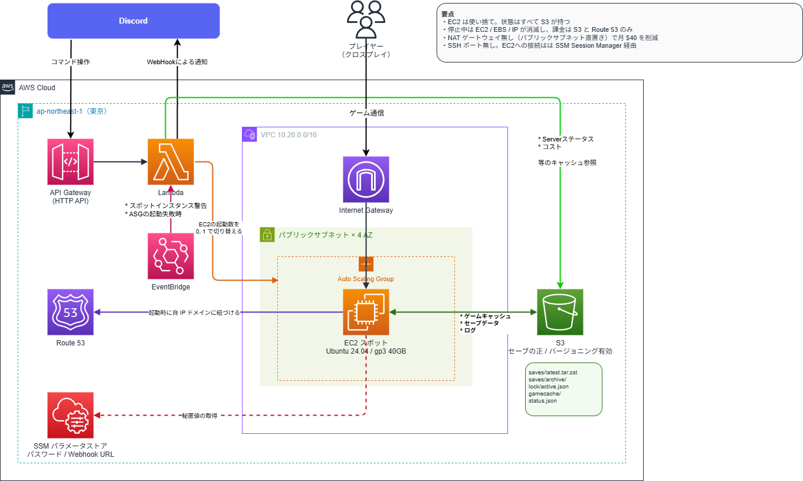

# palworld-server

Discord から起動・停止できる、AWS スポットインスタンス上のパルワールド専用サーバー。

- `/pal start` で起動、`/pal stop` で停止。15 分無人なら自動でセーブして停止
- スポット中断されてもセーブは S3 に保全され、別インスタンスで自動復帰
- 稼働 90 時間/月で **約 $10〜17/月**（停止中は月 $1 未満）



設計の詳細・なぜこの構成なのかは [DESIGN.md](DESIGN.md) を参照。

---

## 前提条件

作業を始める前に、以下がすべて揃っていることを確認してください。

| # | 前提 | 補足 |
| --- | --- | --- |
| 1 | **AWS アカウント** と管理者相当の IAM 権限 | VPC / EC2 / S3 / Lambda / IAM / Route53 / SSM を作成できること |
| 2 | **AWS CLI がローカルで認証済み** | `aws sts get-caller-identity` が成功すること |
| 3 | **Terraform >= 1.10** | `terraform version` で確認（state の S3 ネイティブロックに必要） |
| 4 | **Node.js >= 18** | スラッシュコマンド登録スクリプトの実行に使用 |
| 5 | **独自ドメイン + Route53 パブリックホストゾーン** | 例: `example.com` のゾーンが**すでに Route53 に存在**していること。接続先は `pal.example.com` のようになる |
| 6 | **Discord サーバーの管理権限** | Bot 導入とチャンネル作成ができること |

> **ドメインについての注意**: このゾーンには EC2 インスタンスがレコードを書き込む権限
> (ゾーン単位) を与えます。本番サイトなど他用途と共有しているゾーンの場合は、
> ゲーム専用のサブドメインゾーン (例: `game.example.com`) を切り出すことを推奨します
> (+$0.50/月)。詳細は DESIGN.md のリスク表を参照。

### スポットインスタンスの制約 (理解しておくこと)

- サーバーは **2 分前の予告つきで強制終了されることがあります**。本システムは多層の
  自動セーブでこれに耐える設計ですが、最悪ケースで **5 分ぶんの進行がロスト**しえます
- 中断後は自動で別インスタンスが立ち上がり、**数分待って再接続すれば続き**から遊べます
- 新しい AWS アカウントはスポットの vCPU クォータが低いことがあります。
  起動に失敗する場合は Service Quotas で
  「All Standard Spot Instance Requests」が **8 vCPU 以上**あるか確認してください

---

## セットアップ手順

### 1. Discord アプリケーションを作成する

1. <https://discord.com/developers/applications> → **New Application**
2. **General Information** から以下を控える
   - **Application ID**
   - **Public Key**
3. **Bot** タブ → **Reset Token** で **Bot Token** を控える（コマンド登録に 1 回使うだけ）
4. **Installation** タブ → Install Link を **Guild Install** にし、生成された URL から
   自分の Discord サーバーへアプリを追加する（権限は不要。スラッシュコマンドが使えれば良い）

### 2. 通知用チャンネルと Webhook を作る

1. Discord サーバーに通知用チャンネル（例: `#pal-server`）を作成
2. チャンネル設定 → **連携サービス → ウェブフック → 新しいウェブフック**
3. **Webhook URL** をコピーして控える

> 起動完了・スポット中断警告・セーブ結果などはすべてこのチャンネルに届きます。

### 3. terraform.tfvars を作成する

```bash
cd terraform
cp terraform.tfvars.example terraform.tfvars
```

`terraform.tfvars` を編集し、手順 1〜2 で控えた値と自分のドメインを記入します。
各項目の説明はファイル内のコメントを参照してください。

> `terraform.tfvars` と `*.tfstate` には秘密が含まれます。`.gitignore` 済みですが、
> **絶対にコミット・共有しないでください**。

### 4. デプロイする

Terraform の state（構成の管理台帳。**webhook URL などの秘密が平文で入る**）は
ローカルではなく専用の S3 バケットに置きます。まず state 用バケットを 1 回だけ作成します
（`<ACCOUNT_ID>` は `aws sts get-caller-identity --query Account --output text` の値に置き換え）:

```bash
aws s3api create-bucket --bucket tfstate-palworld-<ACCOUNT_ID> --region ap-northeast-1 --create-bucket-configuration LocationConstraint=ap-northeast-1
aws s3api put-bucket-versioning --bucket tfstate-palworld-<ACCOUNT_ID> --versioning-configuration Status=Enabled
aws s3api put-public-access-block --bucket tfstate-palworld-<ACCOUNT_ID> --public-access-block-configuration BlockPublicAcls=true,IgnorePublicAcls=true,BlockPublicPolicy=true,RestrictPublicBuckets=true
```

続いてデプロイ:

```bash
cd terraform
terraform init -backend-config="bucket=tfstate-palworld-<ACCOUNT_ID>"
terraform apply   # 内容を確認して yes
```

完了すると出力に以下が表示されます（後で `terraform output` でも確認できます）:

- `interactions_endpoint_url` — 次の手順で使う
- `server_address` — ゲームからの接続先

### 5. Interactions Endpoint を登録する

1. Discord Developer Portal → 自分のアプリ → **General Information**
2. **Interactions Endpoint URL** に `terraform output -raw interactions_endpoint_url` の値を貼り付けて **Save**

> 保存時に Discord が検証リクエストを送ります。**保存が成功すれば署名検証まで疎通できて
> いる**ということです。失敗する場合は `discord_public_key` の値を確認してください。

### 6. スラッシュコマンドを登録する

Discord のチャット欄で `/pal` と打ったときに候補が出るようにする手順です。
**PC のターミナルで実行**すると、Discord の API 経由で**あなたの Discord サーバー**に
コマンド定義が登録されます（開発者 Portal での操作はありません）。

必要な値と出どころ:

| 環境変数 | 出どころ |
| --- | --- |
| `DISCORD_TOKEN` | 開発者 Portal (手順 1 で控えた Bot Token) |
| `DISCORD_APP_ID` | 開発者 Portal (手順 1 で控えた Application ID) |
| `DISCORD_GUILD_ID` | **Discord アプリ**: サーバー名を右クリック → サーバー ID をコピー (設定 → 詳細設定 → 開発者モードを ON にすると出る) |

リポジトリのルートで:

```bash
DISCORD_TOKEN=<Bot Token> \
DISCORD_APP_ID=<Application ID> \
DISCORD_GUILD_ID=<サーバー ID> \
node scripts/register-commands.mjs
```

PowerShell の場合:

```powershell
$env:DISCORD_TOKEN="<Bot Token>"
$env:DISCORD_APP_ID="<Application ID>"
$env:DISCORD_GUILD_ID="<サーバー ID>"
node scripts/register-commands.mjs
```

`登録完了: /pal` と出れば成功。Discord で `/pal` と打って候補が出ることを確認して
ください（反映は即時）。Bot Token はこれ以降使いません。

### 7. 起動する

Discord で:

```text
/pal start
```

- **初回はゲーム本体のダウンロードがあるため 6〜8 分**かかります（2 回目以降は 2〜3 分）
- 準備ができると通知チャンネルに接続先が届きます
- ゲーム内の「コミュニティサーバー」→ 下部の IP 入力欄に `pal.example.com:8211` を入力して接続

---

## 日常の操作

| コマンド | 説明 |
| --- | --- |
| `/pal start` | 起動（2〜3 分） |
| `/pal stop` | セーブして停止 |
| `/pal restart` | セーブして再起動 |
| `/pal status` | 状態・接続人数・稼働時間・最終バックアップ |
| `/pal players` | 接続中のプレイヤー一覧 |
| `/pal backup` | 今すぐバックアップ |
| `/pal cost` | 今月の AWS 料金と、現在の時間単価 |

**基本的に消し忘れの心配は不要です。** 15 分間誰も接続していなければ自動でセーブして
停止します（`idle_shutdown_minutes` で変更、`0` で無効化）。

### ゲーム設定を変えたいとき

`terraform.tfvars` の `extra_pal_settings` を編集して `terraform apply`。
次回起動から反映されます（サーバー名・パスワード・経験値倍率など。
設定はセーブとは独立に管理され、コード側が常に正です）。

---

## トラブルシューティング

### `/pal start` しても起動失敗の通知が来る（キャパシティ不足）

スポットの空きが一時的に無い状態。時間をおいて再試行するのが基本ですが、
どうしても今すぐ遊びたい場合は**一時的にオンデマンドへ切り替え**できます:

```bash
aws autoscaling update-auto-scaling-group \
  --auto-scaling-group-name "$(terraform -chdir=terraform output -raw asg_name)" \
  --mixed-instances-policy '{"InstancesDistribution":{"OnDemandPercentageAboveBaseCapacity":100}}'
```

遊び終わったら `terraform apply` で元（100% スポット）に戻してください
（戻し忘れると約 $0.25/h かかります）。

### サーバーに繋がらない

1. `/pal status` で稼働中か確認
2. `nslookup pal.example.com` が IP を返すか確認（起動直後は DNS 反映に最大 60 秒）
3. それでも駄目なら `/pal restart`

### セーブが巻き戻った / 壊れた

S3 バケット（`terraform output s3_bucket`）の `saves/` を確認:

- `latest.tar.zst` のバージョン履歴（S3 コンソール → バージョンを表示）に直近 48 時間ぶんの 5 分刻みの世代があります
- `archive/` に 1 時間刻み・30 日ぶんの世代があります
- 任意の世代を `latest.tar.zst` として上書きアップロードすれば、次回起動時にそれが復元されます

`quarantine/` にファイルがある場合、破損の疑いがあるセーブを隔離した痕跡です
（通知チャンネルに警告が出ています）。

### サーバー内部を直接調べたい

SSH は開けていません。SSM Session Manager を使います:

```bash
aws ssm start-session --target <インスタンス ID>   # ID は /pal status か EC2 コンソール
sudo journalctl -u palworld -f                      # サーバーログ
sudo journalctl -u pal-guardian -f                  # 中断監視ログ
```

### 完全に撤去したいとき

```bash
cd terraform
terraform destroy
```

S3 バケットは誤削除防止（`prevent_destroy`）で失敗します。セーブごと本当に消してよければ
`terraform/s3.tf` の `prevent_destroy` を外し、バケットを空にしてから再実行してください。

---

## 運用コストの目安

| 状態 | コスト |
| --- | --- |
| 稼働中 | 約 $0.09〜0.16/時（スポット相場による） |
| 停止中 | 月 $1 未満（S3 + Route53 のみ） |
| 90 時間/月 遊んだ場合 | **約 $10〜17/月** |

### 実際にいくらかかっているか見る

**Discord から**: `/pal cost`

**ターミナルから**（日別推移のグラフ付き）:

```bash
AWS_PROFILE=prod_admin bash scripts/cost.sh
```

2 つの視点を並べて表示します:

- **今月の実績** — 合計・サービス別内訳・日別推移・着地予測（Cost Explorer 由来。反映が半日〜1 日遅れます）
- **今この瞬間** — 稼働中インスタンスの時間単価（スポット実勢価格 + EBS + IPv4）と、そのセッションでここまでいくら使ったか（遅延なし）

サーバー停止中に実行すると「EC2 の課金は発生していません」と表示されます。

> Cost Explorer は **1 リクエスト $0.01 の有料 API** です。スクリプトは 1 回の実行につき
> 1 コールに抑えていますが、毎日叩くと月 $0.3 になります。気になる場合は週 1 回程度に。

---

## リポジトリ構成

```text
├── DESIGN.md        設計書（アーキテクチャ・セーブ保全の仕組み・設計判断の理由）
├── docs/
│   ├── infrastructure.drawio       インフラ構成図（編集用・draw.io で開く）
│   └── infrastructure.png          同上の書き出し（README 表示用）
├── terraform/       インフラ一式（VPC / ASG / Lambda / S3 / IAM / Route53）
├── server/          EC2 上で動くスクリプト群（S3 経由で配布・AMI 不使用）
├── lambda/          Discord Bot（API Gateway / 依存ゼロ）
└── scripts/         スラッシュコマンド登録
```

> **構成図を更新したとき**は、`infrastructure.drawio` を編集したあと
> draw.io の「エクスポート → PNG」で `infrastructure.png` を上書きしてください。
> README が参照しているのは PNG のほうなので、書き出しを忘れると図が古いままになります。
>
> （SVG を直接埋め込まないのは、draw.io の SVG がテキスト描画に `foreignObject` を使い、
> GitHub のサニタイザにブロックされて表示できないためです）
